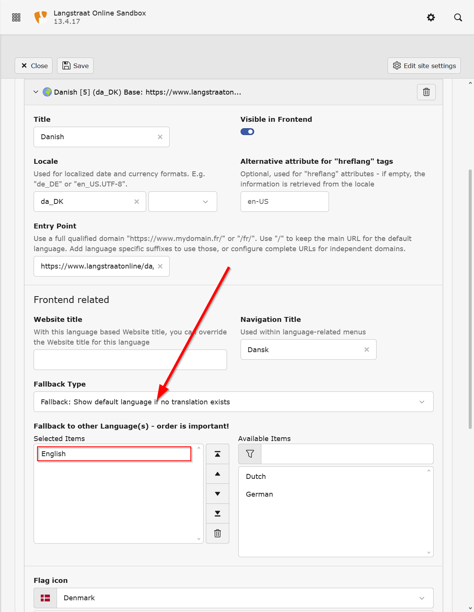
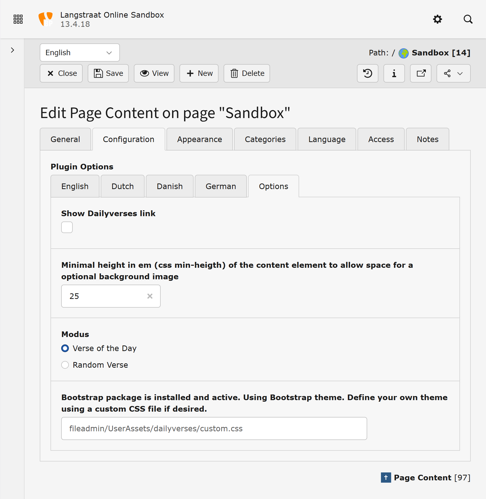
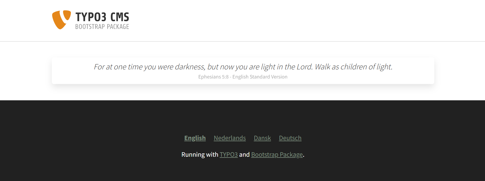
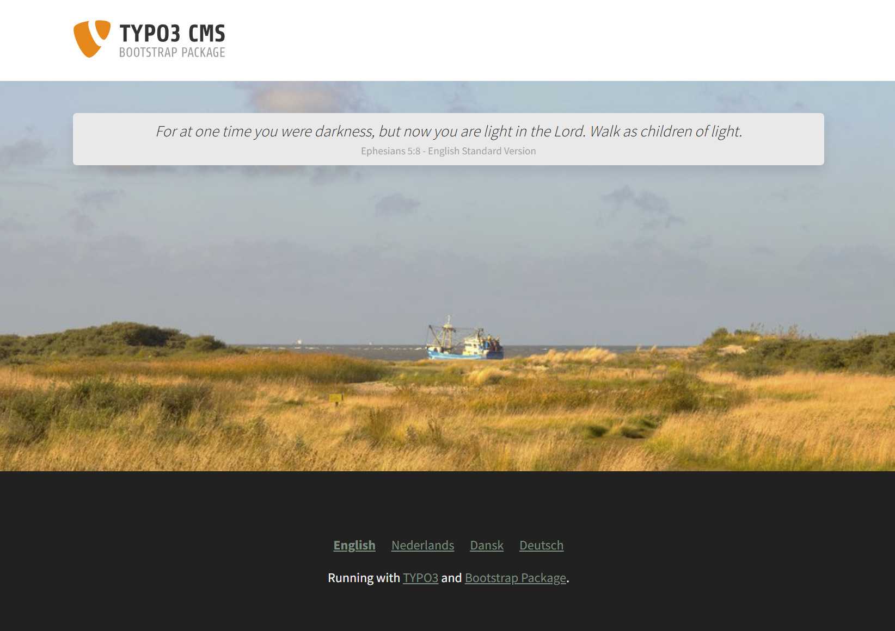

# Daily bible verses

Extension Overview
------------------

This TYPO3 extension provides a frontend plugin that displays a daily Bible verse. It integrates seamlessly with the Bootstrap Package.

Built with Extbase and Fluid, the extension leverages the latest technologies available in TYPO3 version 13 to ensure optimal performance and maintainability.

We gratefully acknowledge Tim from [dailyverses.net](https://dailyverses.net) for generously providing the necessary data free of charge.

- Configuration flexibility: “The plugin offers flexible configuration options, allowing editors to customize the display and translation of verses.”
- Caching or performance note: “Verses are cached to minimize external requests and improve page load speed.”
- License or usage note: “Please refer to the extension’s documentation for licensing and usage guidelines.”

Usage
=====

Site Configuration
------------------


*Edit Site Configuration*

To ensure the plugin functions correctly, it is important to configure the sites properly. The available languages are defined in the site configuration. These are read by the extension when:

* the site configuration is saved
* the extension is installed

Language Fallback Type
----------------------


   *Language Fallback Type*

If the option **"Show default language if no translation exists"** is selected, it is sufficient to refer to the language in which the plugin was created.  
For greater flexibility, the plugin can optionally be created separately for each language.  
In all cases, the plugin will display the language selected in the frontend.

Create New Content
------------------


   *Create New Content*

To use the extension, insert the plugin via the content element wizard.  
Using a headline or any other field is optional.


   *Create New Content – General*

Bible Translations per Language
-------------------------------


*Create New Content – Configuration → Languages*

Options
-------


*Create New Content - Configuration → Options*

* **Show Dailyverse link:**  
  Displays a link in the frontend to [dailyverses.net](https://dailyverses.net)

* **Minimal height:**  
  You can optionally add a background image. To create more space for the image, define a minimum height in `em` below the text.

* **Mode:**  

  * *Verse of the Day:* Daily Bible verse, cached for that date  
  * *Random Verse:* Random Bible verse, not cached

* **Custom CSS:**
  The user may define a custom theme using a CSS file located outside the extension.
  If the `bootstrap_package` extension is installed, Bootstrap theme variables from bootstrap.css will be applied.
  Otherwise, the default styling from dailyverses.css will be used.

> ⚠️ **Warning**  
> If the `bootstrap_package` is removed, installed, or activated, it is important to save the site configuration again. This ensures that the FlexForms are updated to reflect the new situation.

### Voorbeeld `custom.css`
```css
.bibletext-outerFrame {
  background: url("achtergrond.jpg");
  background-size: cover;
  background-position: center;
  padding: 2em;
}

.bibletext-frame {
  padding: 0.5rem;
  border-radius: 0.3rem;
  color: black;
  background-color: white;
  box-shadow: 0 0.5rem 1rem rgba(0, 0, 0, 0.1);
}

.bibletext {
  text-align: center;
  line-height: 1.5;
  font-weight: 300;
  font-size: 120%;
  font-style: italic;
}

.bibleverse {
  text-align: center;
  font-size: 80%;
  opacity: 40%;
}
```

Frontend
--------


Frontend (Background Image)
---------------------------


If you are using `bootstrap_package`, you can add a background using the standard functionality under the **Appearance** tab.  
The **Background Color** field allows you to set a color behind the text content.

If you are not using `bootstrap_package`, you have several alternatives:

* Use custom CSS to apply a background.
* Develop your own templates and add image fields to your FlexForm configuration.

----
## 📜 Change log

Change log
==========

.. list-table::
   :header-rows: 1
   :widths: 10 10 50

   * - Date
     - Version
     - Description
   * - 2025-10-08
     - 13.4.3
     - *  Removed dependancy on bootstrap_package
       *  The user may define a custom theme using a CSS file located outside the extension.
          If the bootstrap_package extension is installed, Bootstrap theme variables from bootstrap.css will be applied.
          Otherwise, the default styling from dailyverses.css will be used.
   * - 2025-10-01
     - 13.4.2
     - Deprecated code has been removed to ensure compatibility with version 14   
   * - 2025-09-30
     - 13.4.1
     - Initial version

----


| Date       | Version | Description |
|------------|---------|-------------|
| 2025-11-12 | 13.4.8  | - Dynamic flexforms moved outside extension to var/</br> - Flexforms are automatically created for each site if they do not exist. |
| 2025-11-07 | 13.4.5  | - Added compatibility for installation via composer |
| 2025-10-08 | 13.4.3  | - Removed dependency on `bootstrap_package`<br> - The user may define a custom theme using a CSS file located outside the extension.<br> - If the `bootstrap_package` extension is installed, Bootstrap theme variables from `bootstrap.css` will be applied.<br> - Otherwise, the default styling from `dailyverses.css` will be used. |
| 2025-10-01 | 13.4.2  | - Deprecated code has been removed to ensure compatibility with version 14 |
| 2025-09-30 | 13.4.1  | - Initial version |
----
